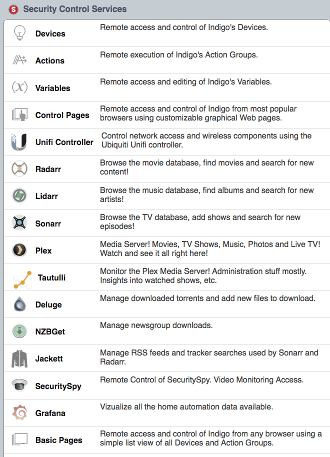

# Autotyed

This repo is a collection of configurations, html snippets and code that provide
a way to present many different applications in a single interface and web address.

This is mostly geared toward macOS X users. I started my server adventure on a mac
because I really like Indigo and SecuritySpy; they're mac-only. All of my trials
and tribulations leading up to a solid home-media environment have been with macs.

As the repo wiki gets built out I expect new solutions to come to fruition and
more Linux and/or Docker support provided. Please check back once in a while for updates!

# HOWTO

Part of the goal of this repo is to document how to
_Reverse Proxy_ the following application through NGINX:

- [Deluge](https://deluge-torrent.org)
- [SecuritySpy](https://www.bensoftware.com/securityspy/)
- [Indigo](https://www.indigodomo.com)
- [Sonarr](https://sonarr.tv)
- [Radarr](https://radarr.video)
- [Lidarr](https://lidarr.audio)
- [Bazarr](https://github.com/morpheus65535/bazarr)
- [Jackett](https://github.com/Jackett/Jackett)
- [NZBGet](https://nzbget.net)
- [Plex](https://www.plex.tv)
- [Tautulli](https://tautulli.com)
- [Ubiquiti UniFI Controller](https://www.ui.com/download/unifi) - latest version not working yet
- [Grafana](https://grafana.com)

Also installs and configures:
- [Nginx](https://www.nginx.com) - web server with auto-renewing SSL cert from [Let's Encrypt](https://letsencrypt.org) using [certbot](https://certbot.eff.org)
- [InfluxDB](https://www.influxdata.com) - time series database for Grafana backend
- [Glances](https://nicolargo.github.io/glances/) - stores systems metrics in InfluxDB
- [unpacker-poller](https://github.com/davidnewhall/unpacker-poller) - to extract Deluge downloads
- [unifi-poller](https://github.com/davidnewhall/unifi-poller) - optionally store UniFI controller metrics in InfluxDB

## Now

What is currently provided:

- An nginx config showing how to route traffic to each application.
- A set of images, css, and html to create a minimal web interface.
- macOS startup scripts for several applications that lack their own.
- Minimal installation script for macOS.
  - Run `make install` to automatically install most of the dependencies on a mac server.
  - You should read through the script and understand what it does before running it.

I'm working on the directions to replicate my entire stack, including
installation, configuration and auto-starting services. I'll link a youtube video
as well once I get the documentation in this repo more put together.

I once ran all these apps on a single server, but recently split the security and
automation roles from the media download and service roles; it's now on two computers
and that's why you'll see two different backend IPs in the nginx configuration. Both
computers are macOS 10.13, but the OSS apps also work on Linux (not Indigo or SecuritySpy).

## Bits and Pieces

I have a handful of custom startup scripts and doohickies for Radarr, Jackett, Sonarr, etc.
I also run a few pieces of custom software (found elsewhere on my github) to move data among these apps.

Documenting how all these pieces of software can be installed, auto-started, monitored
and tied together is the goal of this repo.
More to come, but some of you will figure it out with the breadcrumbs I've provided.

This is what the main screen looks like:

